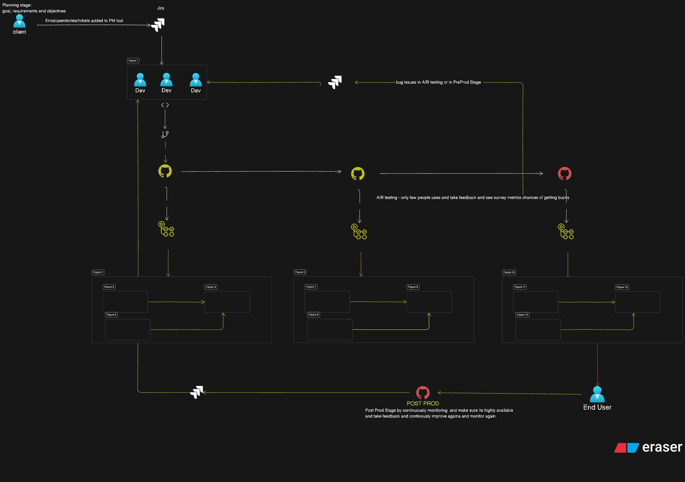

# 🚀 CI/CD for Data Engineering Pipelines – Portfolio Project

## 📊 CI/CD Architecture Diagram

This project simulates a real-world **Data Engineering CI/CD Pipeline** using GitHub Actions, Terraform, AWS (RDS, S3), and Python ETL jobs.
It reflects enterprise-grade workflows for deploying and managing data pipelines with proper branching, testing, staging, and production rollouts.
---

## 📌 Use Case: YouTube Data Ingestion
> Example ETL Job: Ingest YouTube video metadata via API → store in S3 → catalog with Glue → transform → push to Redshift
---

## 🧱 Architecture Summary

| Layer            | Components                                      |
|------------------|-------------------------------------------------|
| DevOps           | GitHub Actions, Terraform, AWS IAM              |
| Infra            | AWS S3, RDS, VPC, IAM, Glue, Redshift           |
| Orchestration    | Airflow / Python Scheduler                      |
| Data Processing  | Python, Boto3, Pandas                           |
| Testing          | Pytest, Smoke & Load Test Scripts               |
| Monitoring       | CloudWatch, basic post-prod alerting setup      |

1. Build a Real or Simulated Project Around This Diagram
Ideas:
- Use Terraform + AWS: Automate infrastructure (e.g., RDS, S3).
- Use Jenkins/GitHub Actions: Build the CI/CD pipeline.
- Deploy sample Data Pipelines using PySpark, Airflow, Glue, etc.
- Use Git branching strategy (feature/main) to simulate team dev.
- Run integration/load tests on staging (simulate test data).
- Trigger deployments to prod automatically after test pass.

## 📊 CI/CD Production Flow
This diagram represents a real-world enterprise deployment workflow using CI/CD practices, integrated with tools like GitHub, AWS, and testing frameworks.
---
### 🧠 1. Planning Stage
- Stakeholders (clients) create epics/stories in Jira or another PM tool.
- Devs pick up tasks from the backlog and begin feature development.
---
### 🧑‍💻 2. Development & Feature Branching
- Developers create a `feature/*` branch.
- Code is committed and pushed frequently.
---
### 🔁 3. Pull Request & Code Review
- A PR is raised to merge into `main`.
- Senior devs or DevOps review the changes before merging.
---
### ⚙️ 4. CI/CD Trigger on `main`
- GitHub Actions or Jenkins triggers a pipeline when code is merged to `main`.
- The CI/CD pipeline:
  - Builds the project
  - Runs unit tests
  - Deploys to **staging**
---
### 🧪 5. Staging Environment
- Mirrors production using near-real data.
- Runs:
  - Smoke tests
  - Integration tests
  - Load tests
- If staging passes, it auto-triggers deployment to **production**.
---
### 🚀 6. Production Deployment
- Fully automated deploy to production (e.g., AWS RDS, S3).
- CI/CD pipeline ensures tested artifacts are used.
- Code is now live for end users.
---
### 📈 7. Post-Production Monitoring
- Logs and performance monitored via **CloudWatch**, **Prometheus**, etc.
- Continuous feedback loop:
  - Capture incidents
  - Alert engineers
  - Improve stability & resilience
---
## 🧱 Tech stack

| Area            | Tools Used                          |
|-----------------|-------------------------------------|
| Version Control | Git, GitHub                         |
| CI/CD           | GitHub Actions                      |
| Infra as Code   | Terraform                           |
| Cloud           | AWS (RDS, S3, EC2, IAM)             |
| Orchestration   | Airflow / GitHub Actions            |
| Monitoring      | CloudWatch, Prometheus              |
| Testing         | Pytest, Load Testing Tools          |

